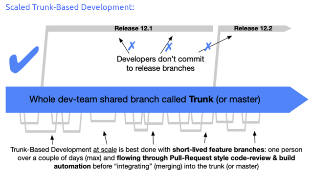

# GitHub

The project is running on GitHub, where the structure of the GitHub is as follows:

- Organization - _GIRAF_
  - Repos - _All the different parts of the projects_
    - Weekplanner
    - Web-api
    - .github
    - ...

## Getting started

In order to be able to work on the project, all of the students need to be registered as either members or owners of the organization GIRAF on GitHub. For this you need at least one person (preferably two, or one from each group) that have been made owners by Ulrik, whom you can contact by email: ulrik@cs.aau.dk.

### Inviting members

When adding new members to the organization it is advised to create a team, fx 2021E, and then add the members to that team. It can also be an idea to create a subteam for each GIRAF-group, so that you can see which group the members belong to. This can be helpful later on in the project.

### Projects

It is possible to control all of the project management through GitHub, where you can create different projects fx:

- Product Backlog
- Server admin
- ...

Where you can keep track of what is happening across the different groups in the project. Al though please be advised that GitHubs issue management is rater limited in its capabilities, so it can be a good idea for the groups to use a more advanced tool within their own groups.

### Handling Pull-Requests

In order to ease the assignment of pull-requests it is possible to use the Github bot in the repository **Input name here**, which will automatically assign people to each pull-request, instead of having to do it manually.
**More info of setup here**

## Branching strategy

The repos _weekplanner, api_client and web-api_ are using the scaled Trunk-Based branching strategy, where the flow is as shown on the picture below.

## Templates

There have been created some templates for issues and pull-requests, which are located in the _.github_-folder, and they are shared across all of the repositories in the GIRAF organization. The templates are written in markdown, where a basic syntax guide can be found here: [Github markdown](https://docs.github.com/en/github/writing-on-github/getting-started-with-writing-and-formatting-on-github/basic-writing-and-formatting-syntax). If you wish to either edit or create new templates, you can add or edit the templates in the _.github_-folder in this repository.

There is currently one PR template and the following issue templates:

- User Story
- Task
- Bug-fix
