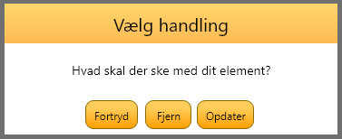

# General 
The general guidelines for the design of the application, where the prototypes can be found in this file:

[Prototypes](prototypes/Prototypes2020E.xd)

Which can be opened in Axure XD, which can be downloaded from the AAU software portal.

## Typography

The font used in the applications is [Quicksand font](https://fonts.google.com/specimen/Quicksand), and it should be used for all text in the application. In regard to font size the following guidelines have been set:
- Pictograms : 150
- Timers : 50
- Buttons : 23
- Small text : 20
- Medium text : 24
- Large text : 30

These font sizes have been declared in the file *font_sizes* in the weekplanner repo. In regard to styling *bold, italic or underlined*, it is prohibited to use any form of styling.

## Color codes

The main theme of the application is orange, where there are different color codes for each part of the application.

### Text and background

|Usage|RGB | HEX| Color |
|---|---|---|---|
| Regular text-color | `0,0,0` | `#000000`| |
| Text-color used to indicate placeholder or hint-texts |`170,170,170`|`#AAAAAA` | |
| Background-color for any applications window background | `0,0,0`|`#000000` | |
| Background-color for any activity | `233,233,233`|`#E9E9E9` | |
| Showcase help text-color |`255,255,255` |  `#FFFFFF` ||

### Buttons

|Usage|RGB|HEX|Color|
|---|---|---|---|
| Regular button background | `255,205,89`   `255,157,0`|`#FFCD59`   `#FF9D00` |  
| Regular button stroke/border | `138,110,0` |`#8A6E00`|  |
| Pressed button background|`212,173,47`  `255,157,0`| `#D4AD2F`   `#FF9D00` |    
| Pressed button stroke/border | `#493700` |`73,55,0`|

### Images

|Usage|RGB|HEX|Color|
|---|---|---|---|
| Image background-color|`255,255,255`| `#FFFFFF`| 
|Image border-color |`0,0,0`| `#000000`| 
|Image marking-color |`254,215,108`| `#FED76C`| 

### Bars

|Usage|RGB|HEX|Color|
|---|---|---|---|
| Background of any bar|`253,187,85`  `254,215,108`| `#FDBB55`  `#FED76C` |    
|Stroke/border of the bar|`229,190,83`| `#E5BE53`| 

### Week indicators

|Usage|RGB|HEX|Color|
|---|---|---|---|
| Monday |`8,160,69` | `#08A045`| 
| Tuesday |`84,13,110` |`#540D6E`| 
| Wednesday |`247,127,0`| `#F77F00`| 
| Thursday |`0,71,119`| `#004777`| 
| Friday |`249,200,14` |`#F9C80E`| 
| Saturday |`219,43,57` |`#DB2B39`| 
| Sunday |`255,255,255` |`#FFFFFF`| 

### Page indicator

|Usage|RGB|HEX|Color|
|---|---|---|---|
| Active page |`255,157,0` |`#FF9D00` |
| Inactive page | `255,205,89` |`#FFCD59`| 

## Buttons
*The design of buttons for the weekplanner application*

|  |  |  |
|:--:| :--: | :--: |
| *Default button* | *Pressed button* | *Disabled button* |

## Icons
*Icons to be used in the application*

| **Name**           | **Icon**                                                                 | **Description**                                                    |
|--------------------|--------------------------------------------------------------------------|--------------------------------------------------------------------|
| Add                |                            | Adds a new instance of an object                                   |
| AddFolder          |                | Creates a new Folder                                               |
| AddTimer           |                  | Adds a new timer to object                                         |
| Back               |                          | Returns the user to the previous page                              |
| BurgerMenu         |              | Opens the side menu                                                |
| Camera             |                      | Indicates a camera can be used to take pictures or to film a video |
| Cancel             |                      | Cancels whatever the user is doing                                 |
| ChangeToCitizen    |    | Changes from guardian to citizen mode                              |
| ChangeToGuardian   |  | Changes from citizen to guardian mode                              |
| Checkmark (accept) |                      | Can be used for when a task is completed by a citizen              |
| Copy               |                          | Indicates that an instance of some object can be copied            |
| Delete             |                      | Deletes selected instances of an object                            |
| Edit               |                          | Edits the given object                                             |
| FallbackImage      |        | Shows that a image was not loaded correctly                        |
| Folder             |                      | Folder for categorizing (e.g. citizens)                            |
| Gallery            |                    | Opens the gallery of device                                        |
| Help               |                          | Opens a help menu                                                  |
| Home               |                          | Returns user to the overview of the weekplan                       |
| Information        |            | Opens a screen with information like the users legal rights                                                  |
| Log in             | TBD                                                                      | Logs in the given user, if credentials are correct                 |
| Log out            |                      | Signs out the current user and sign into another account           |
| Pause              |                        | Pauses the timer                                                   |
| NotSynced          | TBD                                                                      | Indicates that the current object is not syncronized               |
| Profile            |                    | Goes to the users profile                                          |
| ProfileSettings    |    | Goes to the users profile settings                                 |
| Redo               |                          | Reverts an undo to previous state                                  |
| Save               |                          | Saves changes made                                                 |
| Search             |                      | Indicates that it is possible to search for something              |
| Settings           |                  | Accesses the settings menu                                         |
| Start              |                        | Starts the timer                                                   |
| Stop               |                          | Stops and resets the timer                                         |
| Pause              |                        | Pauses the timer                                                   |
| Synced             | TBD                                                                      | Indicates that the current object is syncronized                   |
| Undo               |                          | Reverts latest action                                              |
| AddCitizen         |              | Adds a new instance of a citizen                                   |
| LoadingSpinner     |      | Shown when something needs to be loaded                            |

## Dialogue boxes
*Dialogue boxes should be used whenever a user need to be notified or confirm an action*

